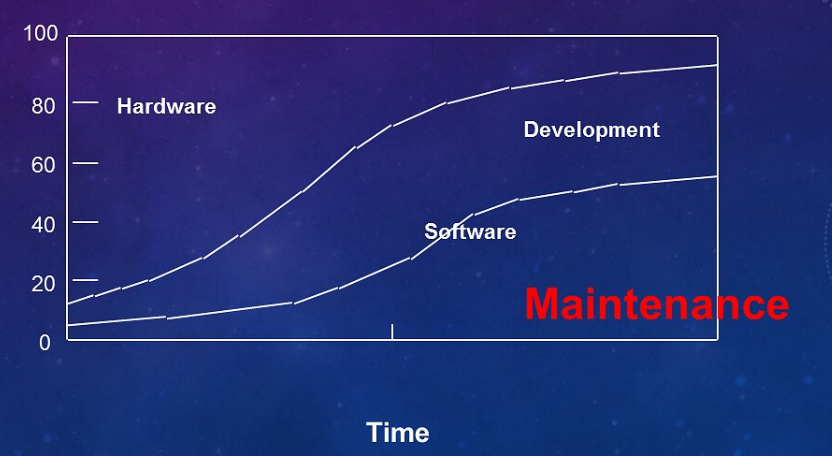
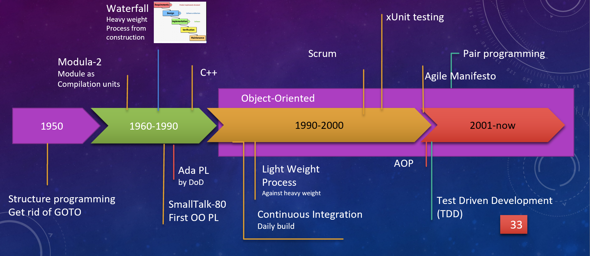

# software engineering
- 傳統軟體的困境: reuse、maintainability、quality、擴充性(evolution)
- 
- 幾乎產品一 released 就會有立即的修改
- Requirement 是個 moving target
- 只能由既有的軟體基礎上進行維護與更新。
- 沒有標準工程圖
- 新的技術如UML 不像其他的工程具備有幾何關係，也就是說軟體的藍圖不能靠單一的圖形表示方式來展示
- 
- 