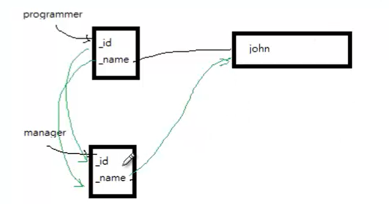

## copy constructor
- copy constructor 是用一個已存在的物件來初始化另一個物件，並為這個新建立的物件初始化一塊記憶體區塊
  - 當執行 `<class> a = b;`，此時新建立的 a 是使用 copy constructor 建立 `<class>` 物件，而不是使用 constructor 建立。
- 若沒有自定義 copy constructor，C++ 會建立一個 default copy constructor 進行 member-wise copy，除非自行 overwrite

### 什麼時候執行
```cpp
Table t1 = t2;
```
它其實等同於下面，也就是用 t2 來初始化 t1。
```cpp
Table t2(t1);
```

### default constructor

這邊舉一個沒有自定義 copy constructor 的例子
> 可以執行 `g++ main.cpp Employee.cpp -o demo` 測試
```cpp
#include <iostream>
using namespace std;
class Employee {
public:
    Employee(char *name, int id);
    ~Employee();
    char *getName(){return _name;}
    //Other Accessor methods
private:
    int _id;
    char *_name;
};

// our self-defined constructor
Employee::Employee(char *name, int id){
    _id = id;
    _name = new char[strlen(name) + 1]; 
    strcpy(_name, name);
}

Employee::~Employee(){
    delete[] _name; 
}
```
下面情況建立了一個叫做 programmer 的 Employee 物件，同時 programmer 物件底下的 `_name` 也 allocate 了一個 char 陣列

```cpp
int main(){
    Employee programmer("John",22);
    cout << programmer.getName() << endl;
    return 0;
} 
```
此時 manager 物件是透過 copy constructor 去建立，但因為我們沒有定義 copy constructor，所以使用預設 copy constructor。當 `main()` 結束時，兩個物件的 destructor 會依序被呼叫，接著就會發生 double free 問題。
```cpp
int main(){
    Employee programmer("John",22);
    cout << programmer.getName() << endl;
    //Lots of code ....
    Employee manager = programmer; 
    //Creates a new Employee "manager",
    // which is an exact copy of the 
    //Employee "programmer".
    return 0;
} 
```

### member-wise copy

在上面的例子中執行 `Employee manager = programmer;` 過後，因為沒有呼叫 constructor，所以系統使用了預設的「逐成員複製（member-wise copy）」copy constructor 來建立 `manager` 物件，這種 member-wise copy 只會把 `programmer` 物件中指標 `_name` 所儲存的位址，複製到 `manager` 物件中的 `_name` 指標，所以結果會變成兩個物件的 `_name` 指向同一塊記憶體，而不是各自擁有一份字串。

```
programmer._name ----\
                      -> "John"
manager._name    ----/
```

也這就是所謂的 shallow copy。

> 而 member-wise copy 是預設的方式，因為上面那段程式碼沒有自行定義 copy constructor。



### 隱患 - dangling pointer
這裡的問題就是當 `delete programmer` 的時候，就會刪除 name 和他配置的記憶體(因為我們的 deconstructor 有 free 掉 char[])，這就讓 manager 指向空的東西，manager 的 `_name` 形成 dangling pointer

### 解決: 宣告一個 copy constructor

我們應該要建立 copy constructor。當執行 `<class> a=b;`，`b` 就是下方被 reference 的 rhs(right hand side)
> signature = 函式名稱 + 參數型別

- copy constructor 輸入的參數是一個物件
```cpp
Employee::Employee(Employee &rhs){
    _id = rhs.getId();
    _name = new char[strlen(rhs.getName()) + 1];
    strcpy(_name,rhs._name);
} 
```