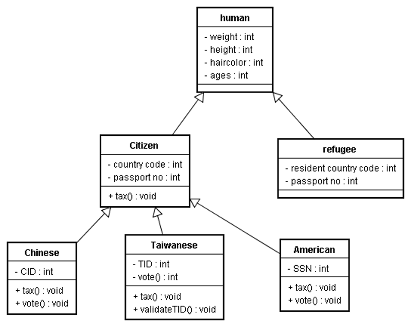

# Inheritance

## Propose 
- 減少重複使用
  - extending additional behavior: 子類別 reuse 父類別(base class) method
  - 子類別 reuse 父類別 member (有條件，請參見下方介紹)
- 子類別可以自行擴充功能

> The subtypes are more specialized(特異化) than the base class.
## 類別權限
- `public`
  - 允許所有類別存取其 member/method
- `protected`
  - 允許子類別存取其 member/method
- `private`
  - 不允許任何類別存取其 member/method，只有自己能存取
  - 如果要做繼承請注意

## Constructor
- constructor / copy constructor / destructor 都不會被繼承

### 記憶體分配順序
以下面 [Pet class](./pet_class/Pet.h) 與 [Cat/Rat class](./pet_class/Cat.h) 為例子，因為 cat 和 rat 繼承 pet 類別，所以在呼叫 constructor 的時候會先建立父類別 (pet) 才建立子類別，同理呼叫 destructor 是先呼叫子類別才呼叫父類別。如果在所有類別的 constructor 中印出訊息，就可以看到順序如下:

> The base class part of an object is always constructed first and destroyed last. The subclass part of an object is constructed last and destroyed first.
```
Pet Constructor
Rat Constructor
Rat Destructor
Pet Destructor
```

## member initialization list
當建立類別物件有傳入參數的時候就會使用 member initialization list，這樣才能在建立父類別 constructor 時就把參數傳入。
> 若放在 method 的 `{}` 就會在父類別 constructor 建立完成後才操作這些參數

```cpp
derived_class(int w, string f, ...) : base_class(w, f, ...) {}
```

```cpp
class Pet {
public:
    Pet(int w) : weight(w), food("Pet Chow") {}
    ...
};

class Rat: public Pet{
public:
    Rat(int w) : Pet(w) {}
};
```

- Rat and Cat constructors that take arguments, which are in turn passed to the appropriate Pet constructor. The base class, Pet, constructor is added to the member initialization list of the derived class constructors. 
- Also notice that for the derived class (Rat and Cat) default constructors, the Pet default constructor does not need to be explicitly called. 

舉 constructor 沒有參數的 class 為例子，其實 default `Rat() {}` 也會呼叫 Pet 不帶參數的 constructor，等同於 `Rat() : Pet() {}`

```cpp
class Pet {
public:
    Pet () : weight(1), food("Pet Chow") {}
    ...
};

class Rat: public Pet{
    public:
    Rat() {} // Rat() : Pet() {}
    ...
};
```

## Overriding
- A derived class can use the methods of its base class(es), or it can override them
- The method in the derived class must have the **same signature and return type** as the base class method to override. 
  - The `signature` is number and type of arguments and the constantness (const, non- const) of the method. When an object of the base class is used, the base class method is called. 
- With overriding, a subclass implements its own version of a base class method. The subclass can selectively use some base class methods as they are, and override others. 

> return type 也是 signature 的一部分
```cpp
Class Pet {
    void dosomething(int a) {}
};

Class Cat {
    void dosomething(int a) {}
};
```
> [!NOTE]
> Overriding is different from overloading. 
> With overloading, many methods of the same name with different signatures (different number and/or types of arguments) are created. 

## Overloading
例如，以下有兩個相同 name、但不同 signature 的 method，這就叫做 Overloading
```cpp
Class X {
    demo (int a) {};
    demo (int a, string b) {};
};
```

- Another important point is that if the base class had overloaded a particular method, overriding a single one of the overloads will hide the rest.
    - For instance, suppose the Pet class had defined several speak methods.
- Generally, if you override an overloaded base class method you should either override every one of the overloads, or carefully consider why you are not. It is a safety protocol enforced by compiler to prevent you from doing such error


```cpp
Class Pet {
    void speak();
    void speak(string s);
    void speak(string s, int loudness);
};

Class Cat {
    // If the subclass, Cat, defined onlyvoid speak();
    // Then speak() would be overridden. 
    // speak(string s) and speak(string s, int loudness) would be hidden. 
    void speak();
};
```
如果這時候讓 Cat 物件執行沒有 Override 的 method 就會噴錯，例如
```cpp
int main() {
    Cat fluffy;
    fluffy.speak(); // correct

    // the following would cause compilation errors.
    fluffy.speak("Hello");
    fluffy.speak("Hello", 10);
}
```

## The Principle of Inheritance

### Wrong example of using Inheritance
```cpp
class EmployeeCensus: public ListContainer {

public:
    ...
    // public routines
    void AddEmployee ( Employee employee ); 
    void RemoveEmployee ( Employee employee );
    Employee NextItemInList();
    Employee FirstItem;
    Employee LastItem;
    ...
private:
    ...
}
```
ListContainer 在這邊應該要用 composition 而不是 inheritance
```cpp
class EmployeeCensus {

public:
    ...
    // public routines
    // The abstraction of all these routines is now at `Employee` Level.
    void AddEmployee ( Employee employee ); 
    void RemoveEmployee ( Employee employee );
    Employee NextItemInList();
    Employee FirstItem;
    Employee LastItem;
    ...
private:
    // That the class uses the ListContainer library is now hidden.
    ListContainer m_EmployeeList;   // composition
    ...
}
```

### When to use
Check the following requirements:
1. is `<sub class>` a `<base class>`
    > 繼承有遞移性(transitive)，以下例子而言，也需要滿足 `An american is a human?`
    > 
2. is `<sub class>` specialized than the `base class`? e.g. have other methods, members
3. `<base class>` is not necessary `<sub class>`
4. `<sub class>` needs all member/method defined in `<base class>`

---
# Polymorphism intro
以 [pet.cpp](./Pet/pet.cpp) 為例子，`pet *nose = (pet *)new cat();` 就是多型，執行後可以看到以下輸出結果

```cpp
pet constructor // insect
pet constructor // pussy 先建立父 constructor
cat constructor // pussy 接著建立自己的 cat constructor
pet constructor // nose
cat constructor // nose
Growl // insect
meow // pusy
Growl // (pet)pussy
pet destructor // pusy
meow // nose
cat destructor // nose
pet destructor 
pet destructor
```

- When you use a subclass to override a base class’s method, C++ will use the current type to determine the method
